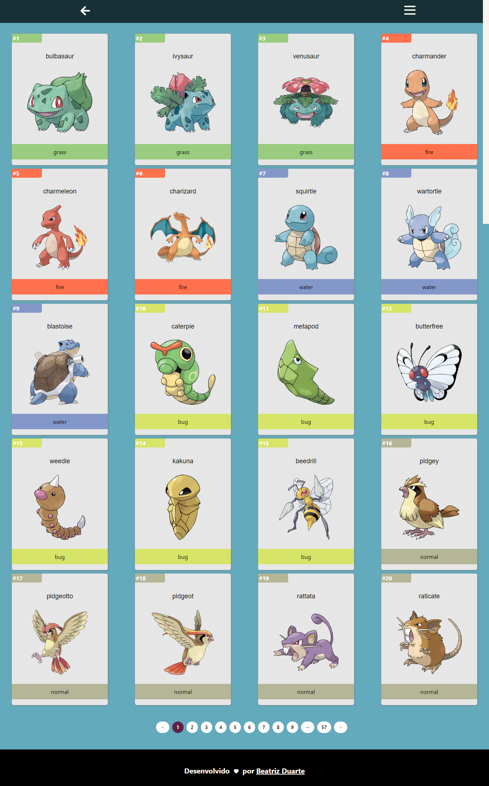

<h1 align="center">PokeCoin</h1>

<h2 align="center">
  
</h2>
<br>


> Status do Projeto: Em andamento :construction_worker:

<br>

## :cat: Descrição 

O PokeCoin é um projeto de uma plataforma de investimento onde você pode realizar compras e vendas de pokemon, cada pokemon possui uma base de experiencia e essa base de experiencia tem relação com seu valor em Bitcoin.
Esse projeto foi desenvolvido utilizando as API'S [Pokemon](https://pokeapi.co/docs/v2) e [Bitcoin](https://www.mercadobitcoin.com.br/api-doc/).


<br>

### :speech_balloon: Tecnologias 

- React
- Node
- Mongoose
- Express
- Typescript
- Axios

## Pré-requisitos

- node
- yarn

## :rocket: Rodando o projeto

```bash
# Clonando o repositorio
$ git clone https://github.com/Beatrizduarte/PokeCoin

# Acessesando a pasta via terminal
$ cd server
```

Em cada diretorio possui um arquivo .env.example, basta editar o nome do arquivo retirnando o .exemple, as configurações de consulta das API já estão no arquivo junto com outras informações mas sinta se a vontade para realizar as suas alterações.

O projeto é dividido em duas partes, por tanto é necessario acessar tanto o server, quanto a web para prosseguir.

```bash
# Instalando as dependências 
$ yarn

# Executando a aplicação
$ yarn start
```

Repita o procedimento anterior em outro terminal porém dentro do diretorio web.

Feito com :heart: por Beatriz Duarte.


